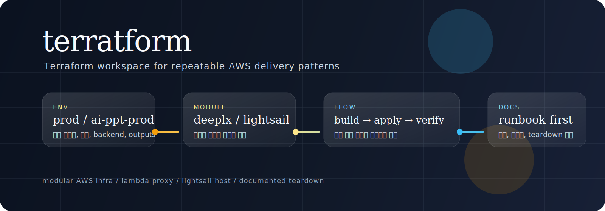
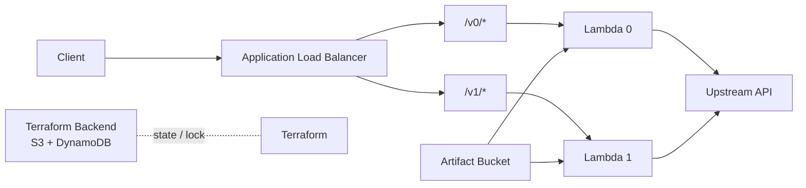

<p align="center">
  
</p>

# terratform

**AWS 인프라를 Terraform으로 관리하고, 서비스별 배포 패턴을 재사용 가능한 모듈로 정리한 워크스페이스.**

이 저장소는 단순히 `.tf` 파일을 모아둔 곳이 아니다.  
현재는 두 가지 흐름을 담고 있다.

- **DeepLX Lambda Proxy**: `ALB + Lambda + S3 artifact + Terraform backend`
- **Lightsail App Host**: Lightsail 기반 웹앱 운영 환경 템플릿

핵심은 서비스별로 다른 배포 방식을 쓰더라도, `env -> module -> docs` 구조를 유지해서 재사용성과 운영 가시성을 같이 챙기는 것이다.

## 무엇을 하는 저장소인가

이 저장소는 아래 작업을 하기 위한 기준 workspace다.

- Terraform으로 AWS 리소스를 선언적으로 생성하고 삭제
- 서비스별 환경을 `infra/envs/*` 로 분리
- 재사용 가능한 인프라 조각을 `infra/modules/*` 로 관리
- 배포 전에 필요한 빌드, 테스트, 검증 흐름 정리
- 실제 배포 후 `verify -> destroy` 까지 닫힌 운영 루프 유지

## 현재 포함된 환경

| 환경 | 목적 | 주요 리소스 | 진입 파일 |
|---|---|---|---|
| `prod` | DeepLX 프록시를 Lambda 기반으로 배포 | ALB, Lambda, Lambda Layer, S3 artifact bucket, VPC | `infra/envs/prod/main.tf` |
| `ai-ppt-prod` | Lightsail 기반 웹앱 운영 환경 | Lightsail instance, static IP, Route53 | `infra/envs/ai-ppt-prod/main.tf` |

## 현재 포함된 모듈

| 모듈 | 역할 | 위치 |
|---|---|---|
| `deeplx_proxy` | DeepLX 프록시용 AWS 리소스 묶음 | `infra/modules/deeplx_proxy` |
| `lightsail_app_host` | Lightsail 기반 앱 호스팅 템플릿 | `infra/modules/lightsail_app_host` |

## 빠른 시작

가장 자주 쓰는 흐름은 `DeepLX Lambda Proxy` 기준이다.

### 1. 요구 사항

- Terraform `>= 1.6`
- AWS CLI 인증 완료
- Python `3.13` 권장
- `zip` 사용 가능 환경

권장 확인:

```sh
terraform version
aws sts get-caller-identity
python3.13 --version
```

### 2. 로컬 아티팩트 빌드

```sh
PYTHON_BIN=python3.13 bash scripts/build-lambda.sh
```

생성물:

- `dist/lambda-app.zip`
- `dist/lambda-layer.zip`

### 3. 로컬 테스트

```sh
source .venv313/bin/activate
PYTHONPATH=app pytest -q
```

### 4. Terraform 입력값 준비

예시 파일을 복사해서 로컬 전용 설정을 만든다.

```sh
cp infra/envs/prod/backend.hcl.example infra/envs/prod/backend.hcl
cp infra/envs/prod/terraform.tfvars.example infra/envs/prod/terraform.tfvars
```

각 파일 역할:

- `backend.hcl`: Terraform state 저장 위치
- `terraform.tfvars`: 실제 배포값

### 5. 초기화 / 검증 / 계획

```sh
terraform -chdir=infra/envs/prod init -backend-config=backend.hcl
terraform -chdir=infra/envs/prod validate
terraform -chdir=infra/envs/prod plan
```

### 6. 배포

```sh
terraform -chdir=infra/envs/prod apply -auto-approve
```

### 7. 정리

```sh
terraform -chdir=infra/envs/prod destroy -auto-approve
```

주의:

- `destroy` 는 Terraform이 관리하는 리소스만 삭제한다.
- backend S3 bucket / DynamoDB lock table 같은 bootstrap 자원은 별도 정리가 필요할 수 있다.

## DeepLX Proxy 구조

현재 `prod` 환경은 아래 흐름으로 동작한다.



핵심 포인트:

- ALB는 path 기반으로 Lambda를 라우팅한다.
- Lambda 코드는 로컬에서 zip으로 빌드한 뒤 S3 artifact bucket을 통해 배포된다.
- Terraform backend는 서비스 리소스와 별개로 관리된다.
- 현재 기본 테스트 구성은 `HTTP only` 이고, HTTPS/도메인은 옵션이다.

## 저장소 구조

```text
.
├── app/
│   └── service/                  # FastAPI Lambda 앱
├── docs/
│   ├── assets/                   # README 시각 자산
│   ├── aws-manual-inputs.md
│   ├── deeplx-lambda-proxy-apply-plan.md
│   ├── deeplx-proxy-runbook.md
│   └── terraform-state-bucket-setup.md
├── infra/
│   ├── envs/
│   │   ├── prod/                 # DeepLX proxy 실행 진입점
│   │   └── ai-ppt-prod/          # Lightsail 기반 운영 env
│   └── modules/
│       ├── deeplx_proxy/         # Lambda + ALB 모듈
│       └── lightsail_app_host/   # Lightsail 템플릿 모듈
├── scripts/
│   ├── build-lambda.sh
│   └── local-run.sh
├── tests/
│   └── test_app.py
└── README.md
```

## 자주 보는 파일

| 파일 | 왜 중요한가 |
|---|---|
| `infra/envs/prod/main.tf` | `prod` 환경에서 어떤 모듈을 어떤 값으로 호출하는지 보여줌 |
| `infra/envs/prod/terraform.tfvars.example` | 실제 배포값이 어떤 형태인지 보여줌 |
| `infra/envs/prod/backend.hcl.example` | Terraform state backend 설정 예시 |
| `infra/modules/deeplx_proxy/main.tf` | 모듈 내부 공통 계산과 입력 검증 |
| `infra/modules/deeplx_proxy/lambda.tf` | Lambda / layer / 로그 그룹 생성 |
| `infra/modules/deeplx_proxy/alb.tf` | ALB / listener / target group / path routing |
| `infra/modules/deeplx_proxy/network.tf` | VPC / subnet / security group |

## 문서 가이드

작업 목적에 따라 아래 문서를 먼저 보면 된다.

| 문서 | 용도 |
|---|---|
| `docs/deeplx-proxy-runbook.md` | DeepLX proxy 배포, 검증, 삭제 전체 흐름 |
| `docs/aws-manual-inputs.md` | AWS에서 직접 확인하거나 만들어야 하는 값 정리 |
| `docs/terraform-state-bucket-setup.md` | state bucket / lock table 준비 |
| `docs/deeplx-lambda-proxy-apply-plan.md` | 초기 설계 방향과 적용 계획 |

## 개발 메모

현재 로컬 검증 기준:

- Python 기본값보다 `python3.13` 사용이 안전함
- `build -> pytest -> terraform validate` 순서로 보는 것이 안정적임
- `prod` 환경의 `backend.hcl`, `terraform.tfvars` 는 로컬 전용으로 `.gitignore` 에 포함되어 있음

## 알려진 전제

- `prod` 환경은 DeepLX Lambda proxy 실습을 기준으로 잡혀 있다.
- `enable_vpc = false` 이면 Lambda는 VPC 밖에서 실행되고, ALB만 VPC public subnet 위에 놓인다.
- HTTPS / custom domain은 값이 주어졌을 때만 활성화된다.
- backend bootstrap 자원은 Terraform 관리 범위와 분리해서 보는 편이 안전하다.

## 라이선스

현재 저장소에는 별도 `LICENSE` 파일이 없다.  
외부 공개용으로 사용할 계획이면 라이선스 정책을 먼저 정리하는 것이 맞다.
