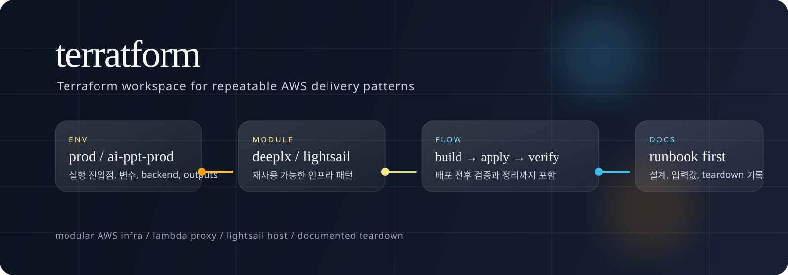

<a id="top"></a>

<p align="center">
  
</p>

# terratform - AWS Terraform 인프라 워크스페이스

<div align="center">


**서비스별 AWS 인프라를 env와 module로 나눠 안전하게 반복 배포하는 Terraform 저장소**

[문서](./docs/deeplx-proxy-runbook.md) | [State 설정](./docs/terraform-state-bucket-setup.md) | [이슈 리포트](https://github.com/juwonparkme/terratform/issues)

</div>

---

## 📋 목차

- [소개](#-소개)
- [주요 기능](#-주요-기능)
- [기술 스택](#-기술-스택)
- [시작하기](#-시작하기)
  - [필수 요구사항](#필수-요구사항)
  - [설치](#설치)
  - [환경 변수 설정](#환경-변수-설정)
  - [배포값 설정](#배포값-설정)
  - [실행](#실행)
- [배포](#-배포)
- [프로젝트 구조](#-프로젝트-구조)
- [주요 기능 상세](#-주요-기능-상세)
- [트러블슈팅](#-트러블슈팅)
- [라이선스](#-라이선스)
- [문의](#-문의)

---

## 🎯 소개

**terratform**은 Juwon Park의 AWS 인프라를 Terraform으로 관리하는 워크스페이스입니다. Lambda 프록시, Lightsail 웹앱 호스트, 서비스별 production env를 같은 구조로 정리해 배포 전 검증과 운영 문서까지 한 흐름으로 묶습니다.

### 핵심 가치

- **환경 분리**: `infra/envs/*`에서 서비스별 실행 단위를 분리
- **모듈 재사용**: `infra/modules/*`에서 Lambda 프록시와 Lightsail 호스팅 패턴 재사용
- **검증 중심 운영**: build, test, validate, plan, apply 순서를 문서와 코드에 고정
- **최소 비용 선택지**: 작은 웹앱은 Lightsail 단일 서버로 시작 가능

---

## ✨ 주요 기능

### 1. DeepLX Lambda Proxy 인프라
- FastAPI 앱을 Lambda + ALB 구조로 배포
- Lambda artifact와 dependency layer를 zip으로 빌드
- ALB path routing으로 여러 Lambda target group 연결
- S3 artifact bucket, IAM role, CloudWatch log group 포함

### 2. Lightsail 웹앱 호스팅 템플릿
- Lightsail instance, static IP, public ports를 공통 모듈로 관리
- `ai-ppt-prod`와 `quiz-ai-prod` 같은 웹앱 env를 같은 방식으로 추가
- Route53 A record는 `domain_name`과 `hosted_zone_id`가 있을 때만 생성

### 3. Terraform state와 운영 문서
- S3 backend와 DynamoDB lock table 설정 예시 제공
- 서비스별 `terraform.tfvars.example`과 `backend.hcl.example` 제공
- runbook과 manual input 문서로 AWS 콘솔 확인값 분리

---

## 🛠 기술 스택

### Infrastructure
- **Terraform >= 1.6** - AWS 리소스 선언 및 state 관리
- **AWS Provider ~> 6.0** - Lightsail, Lambda, ALB, S3, IAM, Route53 관리
- **S3 Backend / DynamoDB Lock** - 원격 state와 동시 실행 잠금

### Application Runtime
- **FastAPI 0.116.1** - DeepLX Lambda Proxy HTTP API
- **Mangum 0.19.0** - FastAPI 앱을 AWS Lambda handler로 연결
- **Python** - Lambda artifact 빌드와 로컬 테스트 런타임

### 배포 및 인프라
- **AWS Lambda + ALB** - DeepLX proxy production 패턴
- **AWS Lightsail** - 최소 비용 웹앱 서버 패턴
- **Nginx / Gunicorn / MySQL** - `quiz-ai-prod` 첫 부팅 구성

### 주요 라이브러리
- **aiohttp** - upstream HTTP 요청 fan-out
- **pydantic / pydantic-settings** - 요청 모델과 환경 설정
- **pytest** - Lambda proxy 단위 테스트

---

## 🚀 시작하기

### 필수 요구사항

- Terraform `>= 1.6`
- AWS CLI 인증 완료
- Python `3.13` 권장
- `zip` 명령
- S3 backend를 쓸 경우 state bucket과 DynamoDB lock table

권장 확인:

```bash
terraform version
aws sts get-caller-identity
python3.13 --version
```

### 설치

1. **저장소 클론**
```bash
git clone https://github.com/juwonparkme/terratform.git
cd terratform
```

2. **개발 의존성 설치**
```bash
python3.13 -m venv .venv313
source .venv313/bin/activate
pip install -r requirements.txt -r requirements-dev.txt
```

### 환경 변수 설정

DeepLX Lambda Proxy 로컬 실행은 기본값만으로 시작할 수 있습니다.

```env
FUNCTION_INDEX=0
REQUEST_TIMEOUT_SECS=30
```

### 배포값 설정

예시 파일을 복사한 뒤 실제 AWS 값으로 채웁니다.

```bash
cp infra/envs/prod/backend.hcl.example infra/envs/prod/backend.hcl
cp infra/envs/prod/terraform.tfvars.example infra/envs/prod/terraform.tfvars
```

Lightsail env는 각 폴더의 `terraform.tfvars.example`을 사용합니다.

```bash
cp infra/envs/quiz-ai-prod/terraform.tfvars.example infra/envs/quiz-ai-prod/terraform.tfvars
```

### 실행

로컬 FastAPI 서버:

```bash
PYTHON_BIN=python3.13 bash scripts/local-run.sh
```

테스트:

```bash
source .venv313/bin/activate
PYTHONPATH=app pytest -q
```

---

## 📦 배포

### DeepLX Lambda Proxy

1. **Lambda artifact 빌드**
```bash
PYTHON_BIN=python3.13 bash scripts/build-lambda.sh
```

2. **Terraform 초기화**
```bash
terraform -chdir=infra/envs/prod init -backend-config=backend.hcl
```

3. **검증과 계획**
```bash
terraform -chdir=infra/envs/prod validate
terraform -chdir=infra/envs/prod plan
```

4. **적용**
```bash
terraform -chdir=infra/envs/prod apply
```

### Lightsail 웹앱 env

`ai-ppt-prod`와 `quiz-ai-prod`는 같은 Lightsail 모듈을 사용합니다.

```bash
terraform -chdir=infra/envs/quiz-ai-prod init -backend=false
terraform -chdir=infra/envs/quiz-ai-prod validate
terraform -chdir=infra/envs/quiz-ai-prod plan -var key_pair_name=<lightsail-key-pair>
```

`quiz-ai-prod`는 첫 부팅에서 Nginx, MySQL, Python venv, Gunicorn systemd service를 구성하고 `/opt/quiz-ai/.env`에 서버 로컬 secret을 만듭니다.

---

## 📁 프로젝트 구조

```text
terratform/
├── app/
│   └── service/                  # FastAPI Lambda proxy 앱
├── docs/
│   ├── assets/                   # README 시각 자산
│   ├── aws-manual-inputs.md
│   ├── deeplx-lambda-proxy-apply-plan.md
│   ├── deeplx-proxy-runbook.md
│   └── terraform-state-bucket-setup.md
├── infra/
│   ├── envs/
│   │   ├── prod/                 # DeepLX Lambda Proxy env
│   │   ├── ai-ppt-prod/          # ai_ppt Lightsail env
│   │   └── quiz-ai-prod/         # Quiz_Ai 최소 비용 Lightsail env
│   └── modules/
│       ├── deeplx_proxy/         # Lambda + ALB + S3 + IAM 모듈
│       └── lightsail_app_host/   # Lightsail app host 모듈
├── scripts/
│   ├── build-lambda.sh
│   └── local-run.sh
├── tests/
│   └── test_app.py
└── README.md
```

---

## 🎨 주요 기능 상세

### 1. Env와 module 분리

- **env**: 실제 실행 단위. provider, backend, tfvars, module 호출을 둠
- **module**: 재사용 가능한 리소스 묶음. 서비스별 env가 입력값만 바꿔 호출
- **현재 env**: `prod`, `ai-ppt-prod`, `quiz-ai-prod`
- **현재 module**: `deeplx_proxy`, `lightsail_app_host`

### 2. DeepLX Lambda Proxy

- **진입점**: `infra/envs/prod/main.tf`
- **앱 코드**: `app/service/main.py`
- **빌드 산출물**: `dist/lambda-app.zip`, `dist/lambda-layer.zip`
- **테스트 엔드포인트**: `/v0/health`
- **프록시 엔드포인트**: `/v0/commit`

### 3. Quiz_Ai 최소 비용 env

- **진입점**: `infra/envs/quiz-ai-prod/main.tf`
- **기본 인스턴스**: Lightsail `micro_3_0`
- **생성 리소스**: instance, static IP, static IP attachment, public ports
- **DNS 옵션**: `hosted_zone_id`를 설정하면 `quiz.juwonpark.me` A record 생성
- **secret 처리**: Terraform state에 앱 secret을 넣지 않고 서버 내부 `.env`에 생성

---

## 🔧 트러블슈팅

### Terraform state bucket이 없다는 오류

**증상**:
```text
Error loading the state: S3 bucket ... does not exist
```

**해결 방법**:
1. `docs/terraform-state-bucket-setup.md`를 먼저 확인합니다.
2. backend S3 bucket과 DynamoDB lock table을 생성합니다.
3. env의 `backend.hcl` 값을 실제 이름으로 수정합니다.
4. `terraform init -reconfigure -backend-config=backend.hcl`을 실행합니다.

### Lambda artifact 파일이 없다는 오류

**증상**:
```text
dist/lambda-app.zip: no such file or directory
```

**해결 방법**:
1. `PYTHON_BIN=python3.13 bash scripts/build-lambda.sh`를 실행합니다.
2. `dist/lambda-app.zip`과 `dist/lambda-layer.zip` 생성 여부를 확인합니다.
3. 다시 `terraform -chdir=infra/envs/prod plan`을 실행합니다.

### Lightsail DNS record가 생성되지 않음

**증상**: plan에 `aws_route53_record`가 나오지 않음

**해결 방법**:
1. 해당 env의 `domain_name`이 `null`이 아닌지 확인합니다.
2. `hosted_zone_id`가 실제 Route53 hosted zone ID인지 확인합니다.
3. DNS를 수동 관리할 계획이면 record가 없는 것이 정상입니다.

## 📄 라이선스

현재 저장소에는 별도 `LICENSE` 파일이 없습니다. 외부 공개 또는 재사용 범위를 정하려면 라이선스 정책을 먼저 확정해야 합니다.

---

## 📞 문의

- **이메일**: hello@juwonpark.me
- **GitHub**: [@juwonparkme](https://github.com/juwonparkme)
- **웹사이트**: [juwonpark.me](https://juwonpark.me)

<div align="center">

**Made by Juwon Park**

[⬆ 맨 위로 이동](#top)

</div>
